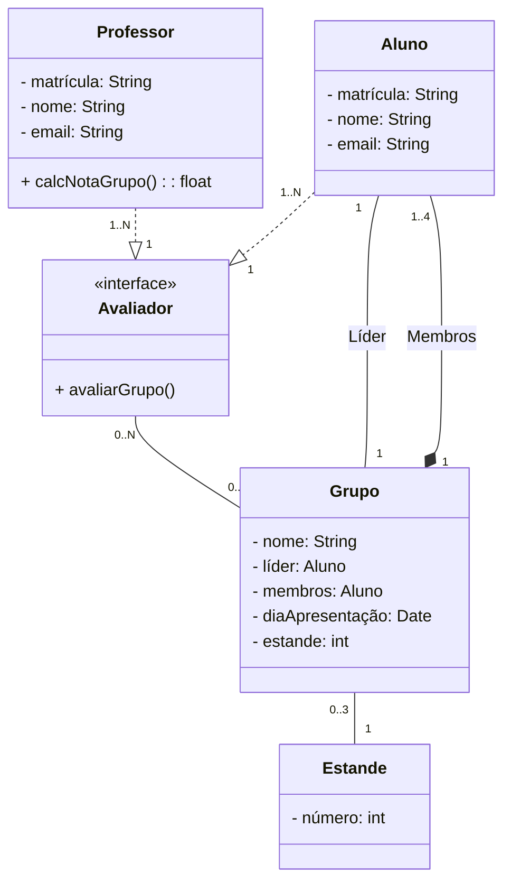

# Sistema de avaliação para o InovaWeek

Sistema que auxilia a avaliação e inserção das notas dos grupos do InovaWeek 2023. Escrito em TypeScript, banco de dados SQLite, e ORM Prisma.

A estrutura das classes foram baseadas no padrão de projeto Singleton, como está abaixo:


1. Professor e Aluno podem avaliar, então foi definida a interface Avaliador que possui o método ```avaliarGrupo()``` para ser utilizada.
   
2. Um grupo é constituído por 1 à 4 alunos, sendo um deles o líder.
3. O grupo faz parte de um Estande, sendo que o Estande terá poderá ter de 0 à 3 grupos, vazio, ou um grupo para cada um dos três dias.

### Instalação do TypeScript e Prisma

#### Iniciando o Node

```node
npm init -y
```

#### Instalando o TypeScript

```node
npm install typescript ts-node @types/node --save-dev
```

#### Inicializando e configurando o TypeScript

```node
npx tsc --init
```

#### Instalando o Prisma CLI

```node
npm install prisma --save-dev
```

#### Inicializando o Prisma

```node
npx prisma init --datasource-provider sqlite
```

#### Migrando os dados para o BD utilizando o Prisma Migrate

```node
npx prisma migrate dev --name init
```
