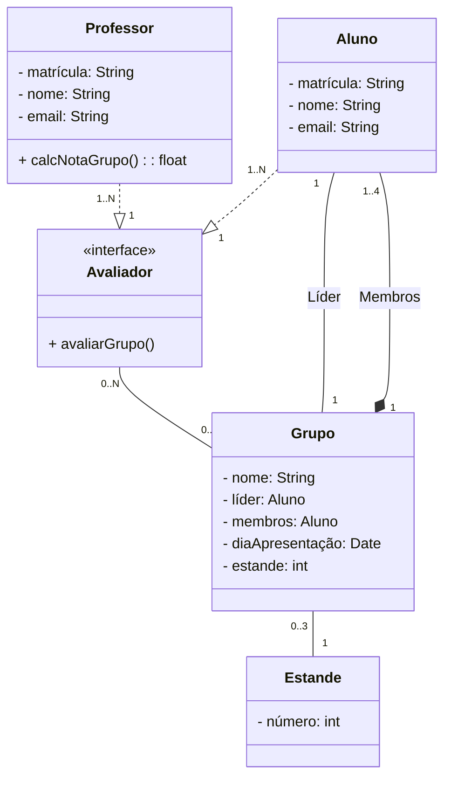

# Sistema de avaliação para o InovaWeek

Sistema que auxilia a avaliação e inserção das notas dos grupos do InovaWeek 2023. Escrito em TypeScript, banco de dados SQLite, e ORM Prisma.

A estrutura das classes foram baseadas no padrão de projeto Singleton, como está abaixo:


1. Professor e Aluno podem avaliar, então foi definida a interface Avaliador que possui o método ```avaliarGrupo()``` para ser utilizada.
2. Um grupo é constituído por 1 à 4 alunos, sendo um deles o líder.
3. O grupo faz parte de um Estande, sendo que o Estande terá poderá ter de 0 à 3 grupos, vazio, ou um grupo para cada um dos três dias.

### Conexão
Foi criada uma conexão com o servidor Express, e mantido com Nodemon por meio de uma porta 8080 http no arquivo app.

```app
export default class App {

    private app: express.Application;
    private port = 8080;

    constructor() {
        this.app = express();
        this.app.use(express.json());
        this.routes();
        this.listen();
    }

    public getApp(): express.Application {
        return this.app;
    }

    private listen(): void {
        this.app.listen(this.port, () => console.log("servidor iniciado na porta " + this.port));
    }

    private routes(): void {
        this.app.use("/aluno", AlunoRoute);
        this.app.use("/professor", ProfessorRoute);
        this.app.use("/grupo", GrupoRoute);
    }
}
```
O CRUD _(create, read, update, delete)_ do servidor no banco de dados é controlado por via do arquivo [app](https://github.com/lokchin/projeto_inova_POO2/blob/main/src/app.ts), configurado com o arquivo [controllers](https://github.com/lokchin/projeto_inova_POO2/tree/main/src/controllers), sendo o CRUD feito em Aluno, Grupo, e Professor.

> rota de Aluno
```Typescript
Por exemplo:
const AlunoRoute = Router();
AlunoRoute.get("/", AlunoController.getAll);
AlunoRoute.post("/insert", AlunoController.insert);
AlunoRoute.patch("/update/:matricula", AlunoController.update);
AlunoRoute.delete("/delete/:matricula", AlunoController.delete);
```
> controle do Aluno
```Typescript
class AlunoController {
    public async insert(req: express.Request, res: express.Response) {
        try {
            const { matricula, nome, email } = req.body;
            const aluno = await AlunoService.insert(new Aluno(matricula, nome, email));
            return res.json(aluno);
        } catch (error) {
            console.log(error);
        }}
    public async update(req: express.Request, res: express.Response) {
        try {
            const antigaMatricula = req.params.matricula;
            const { matricula, nome, email } = req.body;
            const aluno = await AlunoService.update(antigaMatricula, new Aluno(matricula, nome, email));
            return res.json(aluno);
        } catch (error) {
            console.log(error);
        }}
    public async delete(req: express.Request, res: express.Response) {
        try {
            const matricula = req.params.matricula;
            const aluno = await AlunoService.delete(matricula);
            return res.json(aluno);
        } catch (error) {
            console.log(error);
        }}
    public async getAll(req: express.Request, res: express.Response) {
        try {
            const alunos = await AlunoService.getAll();
            return res.json(alunos);
        } catch (error) {
            console.log(error);
    }}}
export default new AlunoController();
```

## Comandos:


## Instalações:
